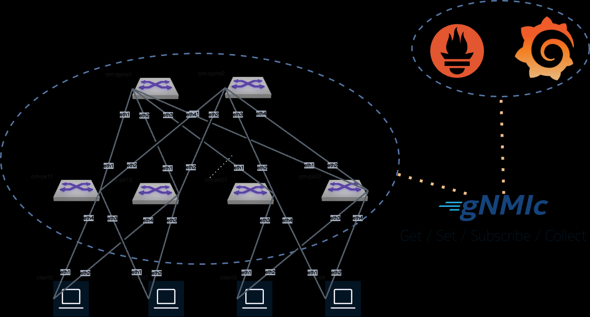

## Introduction

This lab deploys a small cEOS-lab topology using containerlab and
uses [gNMIc](https://gnmic.openconfig.net/) to subscribe and collect telemetry states and output
them into [Prometheus](https://prometheus.io/docs/prometheus/latest/getting_started/) and visualize
the data in [Grafana](https://grafana.com/).

## Prerequisite

- github account

- laptop or server with [Docker](https://www.docker.com/) and [git](https://git-scm.com/downloads) installed

- [arista.com] account to download cEOS-lab

cEOS-lab is autodownloaded using the arista.com token in either codespaces or the devcontainer examples.

Check for more details on the prerequisites on the [Arista Community Labs QuickStart](https://aclabs.arista.com/quickstart/).

## Lab Topology

### Running the lab

The lab can be run in multiple ways:

- codespaces

- locally using devcontainer (either on local PC/laptop or using Remote SSH to a server via vscode)

To run it in codespaces, please press the button below and follow:

<!-- markdownlint-disable -->
[Start :octicons-play-16: gNMIc-Prometheus-Grafana Lab :octicons-mark-github-24:](https://codespaces.new/aristanetworks/aclabs/tree/main?quickstart=1&devcontainer_path=.devcontainer%2Fgnmic-prometheus-grafana%2Fdevcontainer.json){ .md-button .md-button--primary target=_blank}
<!-- markdownlint-enable -->

After the lab is deployed, the containerlab topology will automatically start and Codespaces
will send a notification and reveal the `Open in Browser` button where Grafana can be accessed.

For more details and to run it in devcontainer please check the
[Arista Community Labs](https://aclabs.arista.com/telemetry) site.
