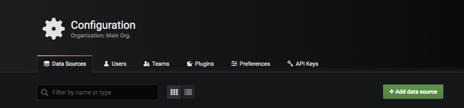
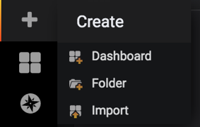
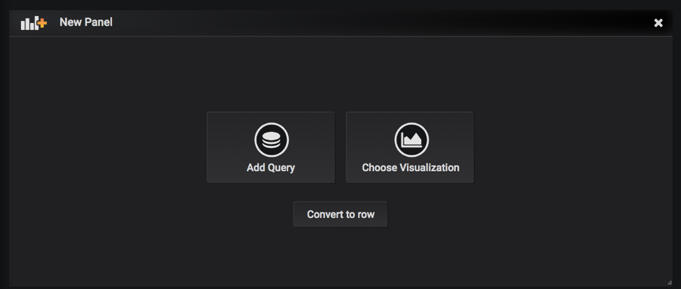
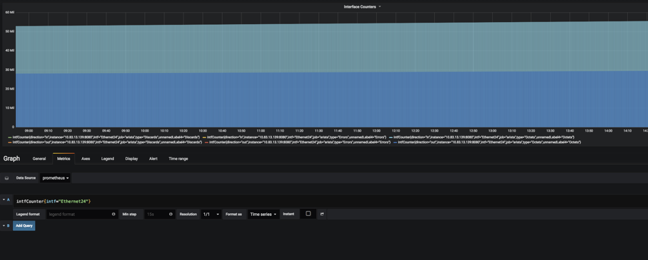
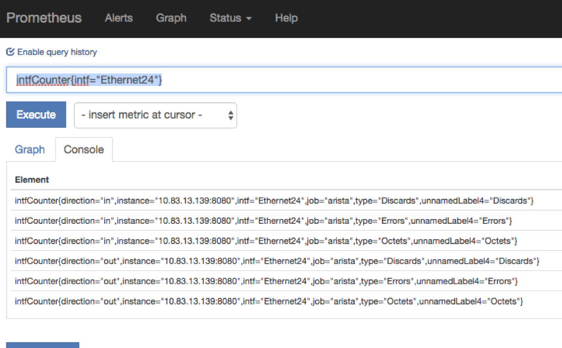
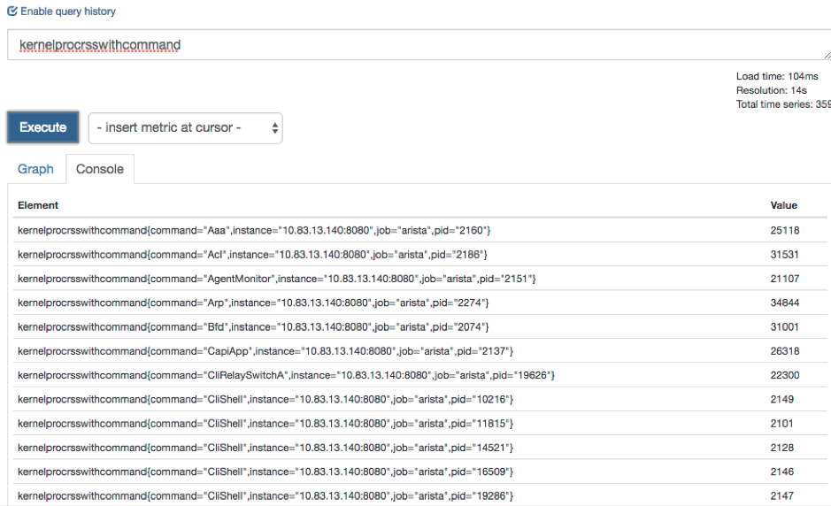
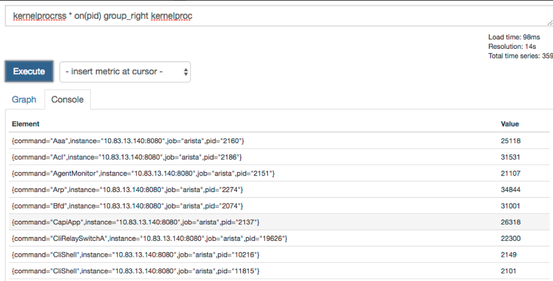
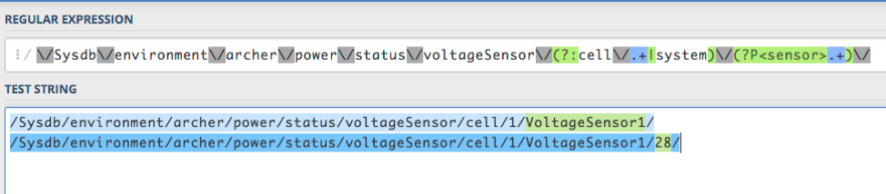
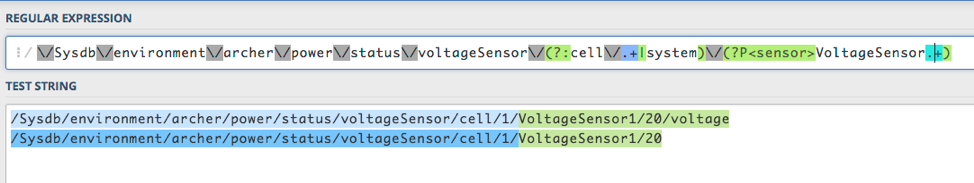

## Introduction

Prometheus is one of the most popular open-source monitoring and alerting systems, which scrapes and stores numeric
time series data over HTTP. It has a very flexible query language, can send alerts via alertmanager to various platform
 and can be integrated easily with many open-source tools. For more details and use cases, please visit [https://prometheus.io/docs/introduction/overview/](https://prometheus.io/docs/introduction/overview/).

The purpose of this article is to show how easy it is to deploy and configure Prometheus and Grafana and
configure Arista switches to send telemetry states to Prometheus using TerminAttr ( EOS streaming telemetry agent )
and one of the OpenConfig connectors that you can find on our official github page.

> Please note, that these apps were written as proof-of-concept and are supported on a best-effort basis.
> The projects can be forked and modified to suit your needs. Feedbacks are always welcomed and issues can be filed
> like for any other projects on github.

## Prerequisites

The following tools will be necessary to be able to install Prometheus and Grafana, clone our project from github
and compile ocprometheus.

- [Homebrew](https://brew.sh/) (for macOS users)
- [Go](https://golang.org/doc/install)
- [Git](https://www.atlassian.com/git/tutorials/install-git)
- [docker](https://docs.docker.com/install/)

## Installing Prometheus and Grafana

There are several ways to install Prometheus and Grafana, the docker approach being the most popular and easiest.

### Installing Prometheus

First, create a minimal Prometheus configuration file on the host filesystem at `~/prometheus.yml`:

`vi ~/prometheus.yml`

Add your targets (network devices IP/hostname + port number) to the ‘scrape configs’ session

Example`prometheus.yml`

```yaml
# my global config
global:
  scrape_interval:     15s # Set the scrape interval to every 15 seconds. Default is every 1 minute.
  evaluation_interval: 15s # Evaluate rules every 15 seconds. The default is every 1 minute.
  # scrape_timeout is set to the global default (10s).

# Alertmanager configuration
alerting:
  alertmanagers:
  - static_configs:
    - targets:
      # - alertmanager:9093

# Load rules once and periodically evaluate them according to the global 'evaluation_interval'.
rule_files:
  # - "first_rules.yml"
  # - "second_rules.yml"

# A scrape configuration containing exactly one endpoint to scrape:
# Here it's Prometheus itself.
scrape_configs:
  # The job name is added as a label `job=<job_name>` to any timeseries scraped from this config.
  - job_name: 'prometheus'
    # metrics_path defaults to '/metrics'
    # scheme defaults to 'http'.
    static_configs:
      - targets: ['localhost:9090']
  - job_name: 'arista'
    static_configs:
      - targets: ['192.0.2.139:8080']
```

Start the Prometheus Docker container with an external configuration file:

```shell
docker run -d \
     -p 9090:9090 -v ~/prometheus.yml:/etc/prometheus/prometheus.yml \
     prom/prometheus \
     -config.file=/etc/prometheus/prometheus.yml
```

If the above doesn’t work, check the latest docker command on the [official Prometheus website](https://prometheus.io/docs/prometheus/latest/installation/).

```shell
docker run \
    -p 9090:9090 \
    -v /tmp/prometheus.yml:/etc/prometheus/prometheus.yml \
    prom/prometheus
```

### Add new targets

In our case, targets are switches, but a target can be any type of device. By default if you are adding new targets by
editing the `prometheus.yml` file on the host, it won’t update the config file in the Docker VM, that is because
every time you insert new characters with VIM and save the file, the inode will change.

#### Option 1

Change the file permission to `664` (`rw-rw-r–`)

`chmod 664 prometheus.yml`

Check if the permissions have been changed

```shell
ls -l prometheus.yml

-rw-rw-r--  1 root root 1076 May 14 12:25 prometheus.yml
```

This will modify the file in your docker VM as well, but the configuration won’t be updated until you restart the
service, which you can do with a one-liner:

```shell
sudo docker exec -i -t eager_kapitsa kill -HUP 1
```

Where eager_kapitsa is the name of the container, which you can find out with the docker ps command:

```shell
root@tac-prometheus-ire:~# docker ps

CONTAINER ID        IMAGE COMMAND                  CREATED STATUS PORTS                    NAMES

47f52778b492        prom/prometheus "/bin/prometheus --c…"   13 days ago Up 6 minutes 0.0.0.0:9090->9090/tcp   eager_kapitsa
3e880f9a951e        grafana/grafana "/run.sh"                3 weeks ago Up 3 weeks 0.0.0.0:3000->3000/tcp   grafana
```

You can always check if the configuration has been updated with the following curl command:

```shell
root@tac-prometheus-ire:~# curl localhost:9090/config

<ommited>
  static_configs:
  - targets:
    - 192.0.2.132:8080
    - 192.0.2.139:8080
    - 10.83.12.109:8080
    - 192.0.2.138:8080
<ommited>
```

Forum that explains this [behavior](https://forums.docker.com/t/modify-a-file-which-mount-as-a-data-volume-but-it-didnt-change-in-container/2813/13).

#### Option 2

> NOTE If you don’t want to change the file permission, you can use the `:set backupcopy=yes` option in VIM, which will make
sure to not change the inode of the file when saving it.

And restart the service again:

```shell
sudo docker exec -i -t eager_kapitsa kill -HUP 1
```

#### Option 3

Use the `–web.enable-lifecycle` flag when running the container.

### Installing Grafana

You can use the following docker command to deploy Grafana in couple of seconds:

```shell
$ docker run \
  -d \
  -p 3000:3000 \
  --name=grafana \
  -e "GF_SERVER_ROOT_URL=http://grafana.server.name" \
  -e "GF_SECURITY_ADMIN_PASSWORD=secret" \
  grafana/grafana
```

> Note: In newer versions of Grafana there are no more implicit volumes for

- /var/lib/grafana
- /var/log/grafana
- /etc/grafana

For more details see what’s new in [Grafana 5.1 and later](https://grafana.com/docs/grafana/latest/installation/docker/#migration-from-a-previous-version-of-the-docker-container-to-5-1-or-later)
 and recommended steps to migrate from older releases.

There’s also a ready-to-go combo of Prometheus/Grafana/docker-stack which you can find at
https://github.com/vegasbrianc/prometheus (credit to Brian Christner)

Now that we have Prometheus and Grafana running, we’re ready to configure our switches and start drawing nice graphs from
 the queried data.

## Installing and configuring ocprometheus

There are a couple of ways to install ocprometheus, and all require for you to compile it with GO.

### Git Clone the Arista GO library

First you’ll need to git clone the goarista repository.

```shell
tamas:~ tamas$ git clone https://github.com/aristanetworks/goarista.git

Cloning into 'goarista'...
remote: Counting objects: 2584, done.
remote: Compressing objects: 100% (10/10), done.
remote: Total 2584 (delta 1), reused 2 (delta 0), pack-reused 2574
Receiving objects: 100% (2584/2584), 945.38 KiB | 767.00 KiB/s, done.
Resolving deltas: 100% (1529/1529), done.
Checking connectivity... done.
```

This will download all the files from that github page and we can then go ahead and compile ocprometheus.

> LPT In case the project you’ve cloned has dependencies on other git project
> you can use the `–recurse-submodules` flag while cloning which will also clone the submodules.

E.g.:

```shell
git clone --recurse-submodules -j8 git://github.com/foo/bar.git
```

### Compile ocprometheus in GO

1\. Go to your ocprometheus folder on your PC/laptop/server

```shell
cd git/goarista/cmd/ocprometheus
```

2\. Compile ocprometheus with the following paramethers:

```shell
GOOS=linux GOARCH=386 go build
```

3\. Copy the binary with SCP to the switch

```shell
scp ocprometheus admin@192.0.2.139://mnt/flash
```

Since EOS has a linux kernel, the OS has to be set to linux and the architecture to 32 bit (386) with GOOS and GOARCH
variables respectively. Starting 4.22.0 we’ve introduced a 64-bit EOS () and you can also compile ocprometheus for
64-bit architecture with the following command:

```shell
GOOS=linux GOARCH=amd64 go build
```

#### Option 1) Using the binary

From this point you can just SCP the binary to a persistent storage on the switch (for example, `/mnt/flash/`) and
just configure the daemon and point it to `/mnt/flash/ocprometheus`

#### Option 2) Install it as a swix

You can also install it as a swix, which requires a bit more effort, however it’s easier to manage swix packages,
and you’ll be able to see the ocprometheus extension in the `show extensions` output.

In order to create a swix file, we first have to compile this binary as an RPM. Building RPMs can be tedious, especially
for networking guys, who are not used to doing things like this.
There are various tutorials online on how to use rpmbuild, but instead of wasting half an hour to create all
the necessary folders and your spec file, etc we can create RPMs with just one line, using FPM (Effing Package Management).

You can download FPM from the following github page:

https://github.com/jordansissel/fpm (credit to Jordan and all who contributed to this project—you’ve made
 our lives easier, Thank you)

The following was done on a Devuan VM (which is basically a lightweight Debian without systemd)
using the following steps:

1\. Create a new folder:

```shell
mkdir fpmbuild
```

2\. Copy the compiled `ocprometheus` and the `sampleconfig.yml` (in this example it was renamed to `ocprometheus.yml`)
downloaded from github:

```shell
cp ~/git/goarista/cmd/ocprometheus/ocprometheus /backup/fpmbuild/
cp ~/git/goarista/cmd/ocprometheus/sampleconfig_above_4.20.yml /backup/fpmbuild/ocprometheus.yml
```

3\. Compile it with fpm:

This one liner will create the RPM package without the need to create all the folders and specs that you’d need to do
with the usual rpmbuild:

```shell
sudo fpm -s dir -t rpm -a all -n "ocprometheus-$(date +%m_%d.%H%M)" \
   -v1.5.6 --prefix /usr/bin/ \
   -C /backup/fpmbuild/ ocprometheus ocprometheus.yml
```

#### Flags cheat sheet

| Flag | Description |
| ---- | ----------- |
| -s dir | Source is a directory |
| -t rpm | Target is an RPM file|
| -a all | User noarch instead of x86_64|
| -n “ocprometheus-$(date +%m_%d.%H%M)“ | the name of the RPM|
| -v 1.5.5 | the version of the RPM will be 1.0|
| --prefix /usr/bin/ | The files will be installed in this directory|
| -C /backup/fpmbuild/ ocprometheus ocprometheus.yml | Change directory to here before searching for files|

4\. Copy the generated file to the switch and install it as a swix:

```shell
root@devuan:/backup# ls -al ocpr*

-rw-r--r--  1 root root 6462872 Jun 17 22:55 oocprometheus-06_17.2255-1.5.6-1.noarch.rpm

root@devuan:/backup# scp ocprom* admin@ats323://mnt/flash/
```

4\.1\. SSH to the switch and create the swix, e.g.:

```shell
ssh admin@ats323

ats323...16:13:36# bash

Arista Networks EOS shell

[admin@ats323 ~]$ cd /mnt/flash


[admin@ats323 flash]$ swix create ocprometheus-1.5.6.swix ocprometheus-06_17.2255-1.5.6-1.noarch.rpm

  adding: manifest.txt (stored 0%)

  adding: ocprometheus-06_17.2255-1.5.6-1.noarch.rpm (stored 0%)
```

4\.2\. Install it as a swix extension

```shell
copy flash:ocprometheus-1.5.6.swix extension:

extension ocprometheus-1.5.6.swix
```

4\.3\. Make it persistent across reloads

```shell
copy installed-extensions boot-extensions
```

4\.4\. Check your extensions

```shell
show extensions

Name                            Version/Release Status Extension
------------------------------- -------------------- ----------- ---------

TerminAttr-1.5.5-1.swix         v1.5.5/1 A, I 25
ocprometheus-1.5.6.swix         1.5.6/1 A, I 1


A: available | NA: not available | I: installed | NI: not installed | F: forced
```

Finally you’ll need to copy the configuration file, which contains the subscription paths.
You’ll find the yaml file on our github page. You can find more details about subscriptions/metrics and
how they are constructed in [https://eos.arista.com/understanding-subscription-paths-for-open-source-telemetry-streaming](https://eos.arista.com/understanding-subscription-paths-for-open-source-telemetry-streaming)

For macOS it’ll be similar with few modifications (tested on macOS Mojave and newer):

1\. Install FPM and RPM

```shell
brew install gnu-tar
gem install --no-ri --no-rdoc fpm
brew install rpm
```

> Note: on macOS Catalina you might need to use `–user-install` when installing gem packages, and instead of `–no-rdoc`
> use `–no-document` .

Xcode might need to be reinstalled if you’ve upgraded from Mojave.

e.g.

```shell
gem install --no-document fpm --user-install
```

2\. Similarly as before, create a folder from where you’ll build your package and copy the compiled binary there

```shell
mkdir fpmbuild

cp ~/git/goarista/cmd/ocprometheus/ocprometheus ~/backup/fpmbuild/

cp ~/git/goarista/cmd/ocprometheus/sampleconfig_above_4.20.yml ~/backup/fpmbuild/ocprometheus.yml
```

3\. Build the rpm with fpm using the following command

```shell
sudo fpm -s dir -t rpm -a noarch --rpm-os linux \
   -n "ocprometheus-$(date +%m_%d.%H%M)" -v1.5.6 \
   --prefix /usr/bin/ -C ~/backup/fpmbuild/ ocprometheus ocprometheus.yml
```

The only difference when using macOS to build your rpm using fpm is that you’ll need to add the `–rpm-os` linux flag,
otherwise it’ll build the rpm for OSX.

> Note: If you are using CVP and maintain your images and extensions with Image bundles, you’ll have to
> add your ocprometheus.swix to Image bundles, otherwise they’ll get removed during an image push operation.

Now it’s time to configure TerminAttr and ocprometheus.

### Sample EOS Configuration

Here’s a sample config for pre EOS-4.19 and post EOS-4.20.7M (CP-ACL) when using VRF MGMT

```shell
!

vrf instance MGMT
!
interface Management1
   vrf forwarding MGMT
   ip address 192.168.58.16/24
!
system control-plane
   ip access-group def2 in
   ip access-group def2 vrf MGMT in
!
daemon TerminAttr
   exec /usr/bin/TerminAttr -disableaaa -grpcaddr MGMT/0.0.0.0:6042
   no shutdown
!
daemon ocprometheus
   exec /sbin/ip netns exec ns-MGMT /usr/bin/ocprometheus -config /usr/bin/ocprometheus.yml -addr localhost:6042
   no shutdown
!
```

You’ll need at least 3 things to configure ocprometheus:

- Location of the binary
- Location of the config file, configured by the -config flag
- gNMI socket of TerminAttr, which can be specified by the `-addr` flag

TerminAttr is running a gRPC server locally on TCP `6042`, which you can check by looking at the logs:

```shell
bash cat /var/log/agents/TerminAttr-`pidof TerminAttr`
```

> NOTE: when installing ocprometheus as a swix file, the binary will be put in `/usr/bin` directory by default
> (you can change that in the RPM making process).

If you compile it in go and copy it to flash you can just change that daemon config to refer to that path
(this way it won’t be installed as a swix).

e.g.

```shell
daemon ocprometheus
   exec /sbin/ip netns exec ns-MGMT /usr/bin/ocprometheus -config /usr/bin/ocprometheus.yml -addr localhost:6042
   no shutdown
```

By default in EOS versions that have control-plane ACL we need to permit TCP port 8080 (default), or
whichever port you decide to use to send data to the Prometheus server (defined in the targets list in `prometheus.yml`)

```shell
 ip access-list def2

  9 permit tcp any any eq 8080
  10 permit icmp any any
  20 permit ip any any tracked
  30 permit udp any any eq bfd ttl eq 255
  40 permit udp any any eq bfd-echo ttl eq 254
  50 permit udp any any eq multihop-bfd
  60 permit udp any any eq micro-bfd
  70 permit ospf any any
  80 permit tcp any any eq ssh telnet www snmp bgp https msdp ldp netconf-ssh gnmi
  90 permit udp any any eq bootps bootpc snmp rip ntp ldp
  100 permit tcp any any eq mlag ttl eq 255
  110 permit udp any any eq mlag ttl eq 255
  120 permit vrrp any any
  130 permit ahp any any
  140 permit pim any any
  150 permit igmp any any
  160 permit tcp any any range 5900 5910
  170 permit tcp any any range 50000 50100
  180 permit udp any any range 51000 51100
  190 permit tcp any any eq 3333
  200 permit tcp any any eq nat ttl eq 255
  210 permit tcp any eq bgp any
  220 permit rsvp any any
```

To check if the port is open you can use `netstat`, e.g.:

```shell
netstat -an | grep :8080
```

Or the network namespace command if VRF is used

```shell
sudo ip netns exec ns-MGMT netstat -an | grep :8080
```

You should see a similar output as below:

```shell
$ sudo netstat -tulnap | grep :8080

tcp6       0 0 :::8080                 :::* LISTEN   17200/ocprometheus
tcp6       0 0 172.28.160.232:8080     192.0.2.78:48956 ESTABLISHED 17200/ocprometheus
```

Or in case of using a VRF:

```shell
$ sudo ip netns exec ns-management netstat -tulnap | grep :8080

tcp6       0 0 :::8080                 :::* LISTEN   12344/ocprometheus
tcp6       0 0 192.0.2.139:8080       192.0.2.78:40820 ESTABLISHED 12344/ocprometheus
```

Don’t be confused if you see tcp6 in the output, that’s expected, as AF_INET6 works for both IPv4 and IPv6 as per RFC [3493](https://tools.ietf.org/html/rfc3493#section-3.7).

> Note: The same configuration is used but no control-plane ACL for 4.20.7M > EOS >4.19 or in newer releases
> where EOS-PDP.swi is used, and you’ll need to allow the Prometheus server IP using `-allowed_ips=<IP/subnet>`

Here are some of the configuration combinations that you might have:

#### No VRF and streaming to both CVP and Prometheus

```shell
!
daemon TerminAttr
  exec /usr/bin/TerminAttr -ingestgrpcurl=192.0.2.33:9910 -cvcompression=gzip -taillogs -ingestauth=key,mysecretkey -smashexcludes=ale,flexCounter,hardware,kni,pulse,strata -ingestexclude=/Sysdb/cell/1/agent,/Sysdb/cell/2/agent -disableaaa
  no shutdown
!
daemon ocprometheus
  exec /usr/bin/ocprometheus -config /usr/bin/ocprometheus.yml -addr localhost:6042
  no shutdown
!
```

#### No VRF and only Prometheus

```shell
!
daemon TerminAttr
  exec /usr/bin/TerminAttr -disableaaa
  no shutdown
!
daemon ocprometheus
  exec /usr/bin/ocprometheus -config /usr/bin/ocprometheus.yml -addr localhost:6042
  no shutdown
!
```

#### VRF management and streaming to both CVP and Prometheus

```shell
!
daemon TerminAttr
  exec /usr/bin/TerminAttr -ingestgrpcurl=192.0.2.79:9910 -cvcompression=gzip -taillogs -ingestvrf=management -ingestauth=key,mysecretkey -smashexcludes=ale,flexCounter,hardware,kni,pulse,strata -ingestexclude=/Sysdb/cell/1/agent,/Sysdb/cell/2/agent -disableaaa -grpcaddr management/0.0.0.0:6042
  no shutdown
!
daemon ocprometheus
  exec /sbin/ip netns exec ns-management /usr/bin/ocprometheus -config /usr/bin/ocprometheus.yml -addr localhost:6042
  no shutdown
!
```

#### VRF and only Prometheus

```shell
!
daemon TerminAttr
  exec /usr/bin/TerminAttr -disableaaa -grpcaddr management/0.0.0.0:6042
  no shutdown
!
daemon ocprometheus
  exec /sbin/ip netns exec ns-management /usr/bin/ocprometheus -config /usr/bin/ocprometheus.yml -addr localhost:6042
  no shutdown
!
```

#### VRF and only Prometheus using authentication

```shell
!
daemon TerminAttr
  exec /usr/bin/TerminAttr -grpcaddr management/0.0.0.0:6042
  no shutdown
!
daemon ocprometheus
  exec /sbin/ip netns exec ns-management /usr/bin/ocprometheus -config /usr/bin/ocprometheus.yml -addr localhost:6042 -username=cvpadmin -password=arista
  no shutdown
!
```

### PDP: VRF and only Prometheus

```shell
!
daemon TerminAttr
  exec /usr/bin/TerminAttr -disableaaa -grpcaddr management/0.0.0.0:6042 -allowed_ips=192.0.2.78/32
  no shutdown
!
daemon ocprometheus
  exec /sbin/ip netns exec ns-management /usr/bin/ocprometheus -config /usr/bin/ocprometheus.yml -addr localhost:6042
  no shutdown
!
```

The minimum required flags for TerminAttr are:

- `disableaaa`: Disable AAA checking—all AAA requests pass (in case username/password is not used in ocprometheus)
- grpcaddr string
     VRF and address to listen on to serve data using the gNMI interface.
     The expected form is `[<vrf-name>/]address:port` (default `127.0.0.1:6042`)

After configuring our switches we can head over to Grafana and start drawing our graphs.

## Creating dashboards in Grafana

First you’ll need to add Prometheus as a data source, to be able to graph streamed data to Prometheus.
You can do this by using the following steps:

1\. Go to Configuration (gear icon) / Data Sources


2\. Add data source and select Prometheus




3\. Fill out the form (add the URL for the Prometheus server e.g.: `http://myprometheus.com:9090/`

It should look like this:


4\. Save & Test

5\. Now we can create our dashboard ( + button on the left)



6\. Add query



7\. Make sure you have ‘Prometheus’ selected as Data Source


After selecting ‘prometheus’ you will be able to add expressions like ‘intfCounter’ , ‘tempSensor’, etc. defined in
the ocprometheus config yaml file.


8\. After adding ‘intfCounter’ to the query, it’ll start plotting the counters for all the interfaces and all the devices
 that Prometheus is polling


9\. Save the dashboard


Finally:

- you can add as many dashboards you want
- you can add more expression on a single graph
- you can choose one line on the graph and it will show the graph for only that line (for example, in interface counters,
you can choose a specific interface to look at the counters for)

### How to graph data only for specific interface?

We can add filters to the queries in both Prometheus console or in grafana, for example, if I want to see data for
interface Ethernet24 I’d use the following filter:

`intfCounter{intf=”Ethernet24″}`





You can filter based on any of the labels defined in the config file (some of them are unnamed,
but you can add a name to those capturing/non-capturing groups inside the config file on EOS).

Some of the paths contains capturing groups that are not named, and Prometheus will give them a name in the following
format: `unnamedLabelX`

For example, for interface counters on a 7160 device I have the following path:

`/Smash/counters/ethIntf/XpCounters/current/(counter)/(?P<intf>.+)/statistics/(?P<direction>(?:in|out))(Octets|Errors|Discards)`

From the above path you can see for example that the direction of the packets is captured in a named capturing group
that also contains a non-capturing group: `(?P<direction>(?:in|out))`

Named capturing groups can be created with `?P<name>`.

We don’t need to capture a separate group for in|out as we already do it with the named capturing group of direction,
so we can use a non-capturing group with ?:

Explanation:

- Named Capture Group: **direction** `(?P<direction>(?:in|out))`
  - Non-capturing group `(?:in|out)`
    - first Alternative in
      - in matches the characters in literally (case sensitive)
    - second Alternative out
      - out matches the characters out literally (case sensitive)

Match for inOctets will be divided like this:

```shell
Match 1
Full match            0-8 inOctets
Group `direction`     0-2   in
Group 2.              2-8 Octets
```

If we wouldn’t use non-capturing group for in|out the result will be the following

```shell
Match 1
Full match         0-8 inOctets
Group `direction`  0-2 in
Group 2.           0-2 in
Group 3.           2-8 Octets
```

Notice the extra group for matching `in`.

Now for `(Octets|Errors|Discards)` there is no name defined, so the result will be

```shell
Match 1
Full match   2-8 Octets
Group 1.     2-8 Octets
```

In this case since we used a capturing group by putting our strings/expression in a parenthesis, Prometheus will
know that it needs to treat it as a separate label, so it gives it a name.

If you don’t want to see unnamedLabels you can add a group name similarly to the direction group.

For example, you can use the following expression: `(?P<packetType>(?:Octets|Errors|Discards))`

Result:

```shell
Match 1
Full match          2-8 Octets
Group `packetType`  2-8 Octets
```

### Pre-defined dashboard

The open-source community is really helpful and thanks to Be Smart Be Open and Vista Technology we have a pre-defined
grafana dashboard for Arista devices which you can find here:

[https://grafana.com/dashboards/10222](https://grafana.com/dashboards/10222)

You can download the dashboard as a JSON file and then import it in Grafana.

Some of the graphs that you’ll find in this dashboard:

- Aggregated traffic
- Traffic by interface
- CPU & Temperature
- Power levels
- Voltage levels
- Interface counters for individual interfaces


> Beware of [https://github.com/grafana/grafana/issues/6888](https://github.com/grafana/grafana/issues/6888)

In case you have modular devices or multilane interfaces, you cannot use a variable to match those interfaces
for example with `intf="$interface"` because Grafana will escape special characters, even if they were
already escaped by Prometheus (it’ll escape it again). So instead of `Ethernet3\\/2` you’ll have `Ethernet3\\\\/2` and
no data will be plotted.

The workaround is to use regex matching by putting the tilda (`~`) character after the equal sign.

`rate(intfCounter{job="$deviceType",instance="$device",intf=~"$interface",type="Octets"}[1m])*8`

You can also use regex matching like below

`rate(intfCounter{job="$deviceType",instance="$device",intf=~"Ethernet(.*\\/.*)?(.*)?",type="Octets"}[1m])*8`

## Using rule records in Prometheus for EOS paths

Rule records allow you to precompute frequently needed expressions and save the result as a new set of time series.
Querying this result will be much faster then executing the original expression and very useful for dashboards,
which need to query the same expression repeatedly.
One example would be to use the `/Kernel/proc/stat/<pid>/comm` as a value label and store the metrics in a new time
series for the other items under that path.

For more details on rule records, please visit the best practices and the configuration section on the official
Prometheus website.

In my example I’ve recorded a rule for the `rss` key under `/Kernel/proc/stat/<pid>/`

Here’s what TerminAttr is streaming under `/Kernel/proc/stat`

`curl localhost:6060/rest/Kernel/proc/stat/1`

Output:

```shell
{
    "cguestTime": 0,
    "cmajflt": 4399,
    "cmdline": "/sbin/init",
    "cminflt": 511393,
    "comm": "systemd",
    "cstime": 3802,
    "cutime": 10380,
    "delayacctBlkioTicks": 0,
    "endcode": 135520894,
    "exitSignal": 17,
    "flags": 4219136,
    "guestTime": 0,
    "kstkeip": 4151638626,
    "kstkesp": 4292454672,
    "majflt": 31,
    "minflt": 10592,
    "name": "1",
    "nice": 0,
    "numThreads": 1,
    "pgrp": 1,
    "policy": 0,
    "ppid": 0,
    "priority": 20,
    "processor": 3,
    "rlim": 18446744073709551615,
    "rss": 1553,
    "rtPriority": 0,
    "session": 1,
    "startcode": 134512640,
    "startstack": 4292456144,
    "starttime": 2,
    "state": 83,
    "stime": 374,
    "tpgid": -1,
    "ttyNr": 0,
    "utime": 601,
    "vsize": 8925184,
    "wchan": 18446744071580351996
}
```

In my example I’ve used the ‘rss’ key and similarly you can create a record for each key.

Here’s how the sample config looks like:

### Ocprometheus.yml on EOS

On the switch, the yml file should look like this (note that I’ve deleted the other paths just for testing purposes).

```shell
# Subscriptions to OpenConfig paths.
subscriptions:
        - /Kernel/proc
# Prometheus metrics configuration.
# If you use named capture groups in the path, they will be extracted into labels with the same name.
# All fields are mandatory.

metrics:
        - name: kernelprocrss
          path: /Kernel/proc/stat/(?P<pid>.+)/rss
          help: KernelProcRSS
        - name: kernelproc
          path: /Kernel/proc/stat/(?P<pid>.+)/comm
          help: KernelProcStat
          valuelabel: command
          defaultvalue: 1
```

On the Prometheus server, you’ll need to add a rules file and edit your prometheus.yml to specify the path to that file.

### Prometheus.yml on the server

You’ll need to create another yml file for the rules and mention it in the prometheus.yml file under the rule_files key.

`cat prometheus.yml`

Output:

```shell
# my global config

global:
  scrape_interval:     15s # Set the scrape interval to every 15 seconds. Default is every 1 minute.
  evaluation_interval: 15s # Evaluate rules every 15 seconds. The default is every 1 minute.
  # scrape_timeout is set to the global default (10s).

# Alertmanager configuration

alerting:
  alertmanagers:
  - static_configs:
    - targets:
      # - alertmanager:9093

# Load rules once and periodically evaluate them according to the
# global 'evaluation_interval'.

rule_files:
  # - "first_rules.yml"
  # - "second_rules.yml"
    - "kernel_rules.yml"

# A scrape configuration containing exactly one endpoint to scrape:
# Here it's Prometheus itself.

scrape_configs:
  # The job name is added as a label `job=<job_name>` to any
  # timeseries scraped from this config.

  - job_name: 'prometheus'
    # metrics_path defaults to '/metrics'
    # scheme defaults to 'http'.
    static_configs:
      - targets: ['localhost:9090']
  - job_name: 'arista'
    static_configs:
      - targets: ['192.0.2.140:8080','198.51.100.21:8080','192.0.2.132:8080','192.0.2.139:8080','192.0.2.138:8080']
```

### Kernel_rules.yml on the server

```shell
groups:
 - name: test
   rules:
    - record: kernelprocrsswithcommand
      expr: kernelprocrss * on(pid) group_right kernelproc
```

> Note, if you did not mount the kernel_rules.yml file when creating your docker container (as I did) you’ll need
> to copy the file over to your container with the following command

```shell
docker cp kernel_rules.yml eager_kapitsa:/etc/prometheus/
```

Checking on the GUI, it will give you the following results



You can also use the expression from the `kernel_rules.yml` directly on the GUI



After you create the records and update the yml files on the server, make sure you can see the rule created in
the Status—Rules submenu


## Using ocprometheus with the OpenConfig/OCTA agent (management api gnmi)

While ocprometheus can subscribe to EOS native paths provided by TerminAttr’s gNMI server on TCP `6042`
(default, can be changed), it can also subscribe to OpenConfig paths provided by the OpenConfig/OCTA agent’s gnmi server
on TCP `6030` (default, can be changed). For example to subscribe to interface counters the subscription and
the metric path would look like below:

```yaml
subscriptions:
     - /interfaces/interface
metrics:
     - name: intfCounter
       path: /interfaces/interface\[name=(?P<intf>[^\]]+)\]/state/counters/(?P<countertype>.+)
```

OpenConfig and EOS native paths can be mixed when using OCTA and in that case the origin must be specified. Since the
default origin is openconfig, the origin has to be only specified for EOS native paths under the subscriptions key,
e.g.:

```yaml
subscriptions:
   - /interfaces/interface
   - eos_native:/Kernel/proc
```

> Note On EOS 4.23+ it's highly recommended to use OCTA with ocprometheus and only use `eos-native` paths where
> an openconfig model does not exist.

### Example configurations

#### No VRF - gnmi/OCTA + ocprometheus

```shell
   management api gnmi
      transport grpc def
      provider eos-native
   !
   daemon ocprometheus
      exec /mnt/flash/ocprometheus -config /mnt/flash/ocprometheus.yml -addr localhost:6030 -username admin
       no shutdown
```

#### VRF - gnmi/OCTA + ocprometheus

```shell
   management api gnmi
      transport grpc def
         vrf management
      provider eos-native
      !
   daemon ocprometheus
      exec /sbin/ip netns exec ns-management /mnt/flash/ocprometheus -config /mnt/flash/ocprometheus.yml -addr localhost:6030 -username admin
      no shutdown
```

### Cert-based authentification with ocprometheus

1. Follow the steps mentioned in [Certificate Authentification Configuration
   page](https://aristanetworks.github.io/openmgmt/configuration/mtls/).
2. Copy the client certificate and client key to the `/persist/secure/ssl` and `/persist/secure/keys` directory
   respectively.
3. The EOS configuration should look like the following:

```shell
management api gnmi
   transport grpc def
      ssl profile test-arista
      vrf MGMT
   provider eos-native
!
management security
   ssl profile server
      certificate v1.crt key v1.key
      trust certificate demo-ca.crt
!
daemon ocprometheus
   exec /sbin/ip netns exec ns-MGMT /usr/bin/ocprometheus -config /usr/bin/ocprometheus.yml -addr localhost:6030 -certfile /persist/secure/ssl/certs/gnmi-client.crt -keyfile /persist/secure/ssl/keys/gnmi-client.key -cafile /persist/secure/ssl/certs/demo-ca.crt
   no shutdown
!
```

## Troubleshooting tips

### Checking Logs and troubleshooting

As any daemon/agent, logs are saved in /var/log/agents/ so we can either read those in bash with cat/more/less/vi/nano
or from the CLI using the show agent <agent_name> logs command.

### Common issues

#### Context_deadline_exceeded

Seeing context_deadline_exceeded in the Targets section of the Prometheus GUI.
This means connectivity is not established between the switch and the Prometheus server, which can be due to several reasons:

- TerminAttr and/or ocprometheus is not running
- TerminAttr and/or prometheus are not configured in the correct namespace/vrf
- Port 8080, which is used by default is not open on the switch (please check with `netstat -an | grep 8080`
  or `sudo ip netns exec ns-<vrf_name> netstat -an | grep 8080` if using a vrf; make sure the control plane ACL is
  updated and applied to vrf default or the specific vrf when using EOS version with CoPP
- Make sure TerminAttr is communicating with ocprometheus
- TerminAttr should have the -disableaaa flag added

#### Not seeing any streams on Prometheus

Check TerminAttr version (After TerminAttr 1.5.1 we replaced the deprecated `gnmi.Value` with `gnmi.TypedValue`).
This was only changed on our OpenConfig connectors (ockafka, ocprometheus, octsdb, ocredis, etc.) after March, 2019, thus
older ocprometheus versions will ignore the updates.

The version of ocprometheus that uses TypedValue as well was pushed to [github](https://github.com/aristanetworks/goarista/commit/22b2444f947b7d395b5c227cf0dd881d0100bdb1)
on March 19, 2019. A newer commit was done
in the beginning of June to deal with [coalesced deletes](https://github.com/aristanetworks/goarista/commit/fef20d617fa7e1c7509e958fd3bd49cf4a4af5c0),
and it’s recommended to use the latest version.

The best way to check if you are hitting any issues is to enable verbosity for ocprometheus with `-v 9`

```shell
!
daemon ocprometheus
   exec /sbin/ip netns exec ns-management /mnt/flash/ocprometheus -config /mnt/flash/ocprometheus20190319.yml -addr localhost:6042 -v 9
   no shutdown
!
```

In `/var/log/agents/ocprometheus-<pid>` you’ll see error messages like below  ( Ignoring incompatible update value ) :

```shell
I0319 13:41:11.899488    5386 collector.go:77] Ignoring incompatible update value in path:<elem:<name:"vsize" > > val:<json_val:"4505600" >
I0319 13:41:11.899518    5386 collector.go:77] Ignoring incompatible update value in path:<elem:<name:"startstack" > > val:<json_val:"4289154048" >
I0319 13:41:11.899548    5386 collector.go:77] Ignoring incompatible update value in path:<elem:<name:"kstkesp" > > val:<json_val:"0" >
I0319 13:41:11.899578    5386 collector.go:77] Ignoring incompatible update value in path:<elem:<name:"exitSignal" > > val:<json_val:"17" >
I0319 13:41:11.899608    5386 collector.go:77] Ignoring incompatible update value in path:<elem:<name:"state" > > val:<json_val:"83" >
I0319 13:41:11.899638    5386 collector.go:77] Ignoring incompatible update value in path:<elem:<name:"cmajflt" > > val:<json_val:"0" >
I0319 13:41:11.899668    5386 collector.go:77] Ignoring incompatible update value in path:<elem:<name:"priority" > > val:<json_val:"20" >
I0319 13:41:11.899698    5386 collector.go:77] Ignoring incompatible update value in path:<elem:<name:"delayacctBlkioTicks" > > val:<json_val:"0" >
```

Make sure you’re running the latest ocprometheus and TerminAttr versions.

#### Broken paths due to incorrect regex

Some of the subscription paths in the sample config file might not work on all type of devices.
In case of broken paths, unfortunately we won’t stream anything, and you might encounter a similar error as below when
checking the metrics URL (http://x.x.x.x:8080/metrics) of a modular device:

```shell
An error has occurred during metrics gathering:


17 error(s) occurred:

* collected metric voltageSensor label:<name:"sensor" value:"21" > label:<name:"unnamedLabel2" value:"voltage" > gauge:<value:1.040771484375 >  was collected before with the same name and label values

* collected metric voltageSensor label:<name:"sensor" value:"22" > label:<name:"unnamedLabel2" value:"voltage" > gauge:<value:0.996826171875 >  was collected before with the same name and label values

* collected metric voltageSensor label:<name:"sensor" value:"12" > label:<name:"unnamedLabel2" value:"voltage" > gauge:<value:11.93359375 >  was collected before with the same name and label values
```

This can happen if the regexp matching is incorrect. The regexp path in question is:

`/Sysdb/environment/archer/power/status/voltageSensor/(?:cell/.+|system)/(?P<sensor>.+)/(voltage)`

This would match on `VoltageSensorX`, however if you check the list of voltage sensors using curl, you’ll see that the
sensors have the following format: `VoltageSensorX/Y`

```shell
$ curl localhost:6060/rest/Sysdb/environment/archer/power/status/voltageSensor/cell/1/

{
    "VoltageSensor1/12": {
        "_ptr": "/Sysdb/environment/archer/power/status/voltageSensor/cell/1/VoltageSensor1/12"
    },
    "VoltageSensor1/13": {
        "_ptr": "/Sysdb/environment/archer/power/status/voltageSensor/cell/1/VoltageSensor1/13"
    },
    "VoltageSensor1/14": {
        "_ptr": "/Sysdb/environment/archer/power/status/voltageSensor/cell/1/VoltageSensor1/14"
    },
```

You can validate your regular expression using a regexp app (e.g [regex101](https://regex101.com/)):

As you can see we are only matching `VoltageSensorX`



To correct the issue, we can use the following path instead:

`/Sysdb/environment/archer/power/status/voltageSensor/(?:cell/.+|system)/(?P<sensor>VoltageSensor.+)/(voltage)`

As you can see, we are able to match on both VoltageSensorX and VoltageSensorX/Y .



#### Authentication failed

When you see the following message, it means that ocprometheus is not able to connect to the gRPC server that
TerminAttr/OpenConfig/OCTA is serving, either because the `disableaaa` flag is not specified in the TerminAttr
config (in case of using TerminAttr) or the username and password strings are incorrect in the ocprometheus config.

```shell
cat ocprometheus-11069

===== Output from /sbin/ip ['netns', 'exec', 'ns-management', '/mnt/flash/ocprometheus', '-config', '/mnt/flash/ocprometheus.yml', '-addr', 'localhost:6042'] (PID=11069) started Jun 17 11:27:35.313690 ===

F0617 11:27:35.449652   11069 main.go:90] rpc error: code = Unauthenticated desc = Authentication failed
```

#### Connection refused

You might see the following error:

```shell
cat ocprometheus-10314

===== Output from /sbin/ip ['netns', 'exec', 'ns-management', '/mnt/flash/ocprometheus', '-config', '/mnt/flash/ocprometheus.yml', '-addr', 'localhost:6042'] (PID=10314) started Jun 17 11:21:05.494319 ===

F0617 11:21:05.533516   10314 main.go:90] rpc error: code = Unavailable desc = all SubConns are in TransientFailure, latest connection error: connection error: desc = "transport: Error while dialing dial tcp 127.0.0.1:6042: connect: connection refused"
```

When you get connection refused, it means that the gRPC server is not reachable. In this case ocprometheus is executed
in the management VRF, however TerminAttr is running in the default VRF and the gRPC server by default is running in
the default VRF too. To fix it you can configure the gRPC server in the correct VRF:

- in case of TerminAttr using `-grpcaddr <vrf>/<IP>:<port>`:

```shell
-grpcaddr management/0.0.0.0:6042
```

- in case of using OpenConfig/OCTA:

```shell
management api gnmi
  transport grpc management
     vrf management
  provider eos-native
```

## Subscription paths

You can find sample configuration files on our github page in the [sample_configs](https://github.com/aristanetworks/goarista/tree/master/cmd/ocprometheus/sample_configs)
directory, which contains per-platform EOS-native path examples but also OpenConfig path examples which are standard
across all platforms in the [ocprometheus_gnmi_4.23.yaml](https://github.com/aristanetworks/goarista/blob/master/cmd/ocprometheus/sample_configs/ocprometheus_gnmi_4.23.yaml)

In this file, which is referred with the `-config /mnt/flash/ocprometheus.yml` flag and config file in the daemon
ocprometheus configuration, you can add your desired Sysdb paths

More examples (per platform + gnmi paths) can be found in the sample_configs folder.

Commonly used paths:

- MAC table: `/Smash/bridging/status/smashFdbStatus`
- ARP table: `/Smash/arp/status/arpEntry`
- Neighbor table: `/Smash/arp/status/neighborEntry`
- IPv4 RIB: `/Smash/routing/status/route`
- IPv6 RIB: `/Smash/routing6/status/route`
- IPv4 next-hop table: `/Smash/routing/status/nexthop`
- IPv6 next-hop table: `/Smash/routing6/status/nexthop`
- CPU info: `/Kernel/proc/cpu`
- Process statistics: `/Kernel/proc/stat`
- System info: `/Kernel/sysinfo`
- Interface counters: `/Smash/counters/ethIntf/<agent>/current/counter`

For details about subscription paths and metric path structures please visit: <https://eos.arista.com/understanding-subscription-paths-for-open-source-telemetry-streaming>

## Useful links

- [https://prometheus.io/docs/prometheus/](https://prometheus.io/docs/prometheus/)
- [https://grafana.com/docs/](https://grafana.com/docs/)
- [http://docs.grafana.org/installation/docker/](http://docs.grafana.org/installation/docker/)
- [https://grafana.com/dashboards](https://grafana.com/dashboards)
- [https://fpm.readthedocs.io/en/latest/installing.html](https://fpm.readthedocs.io/en/latest/installing.html)
- [https://regex101.com/](https://regex101.com/)
